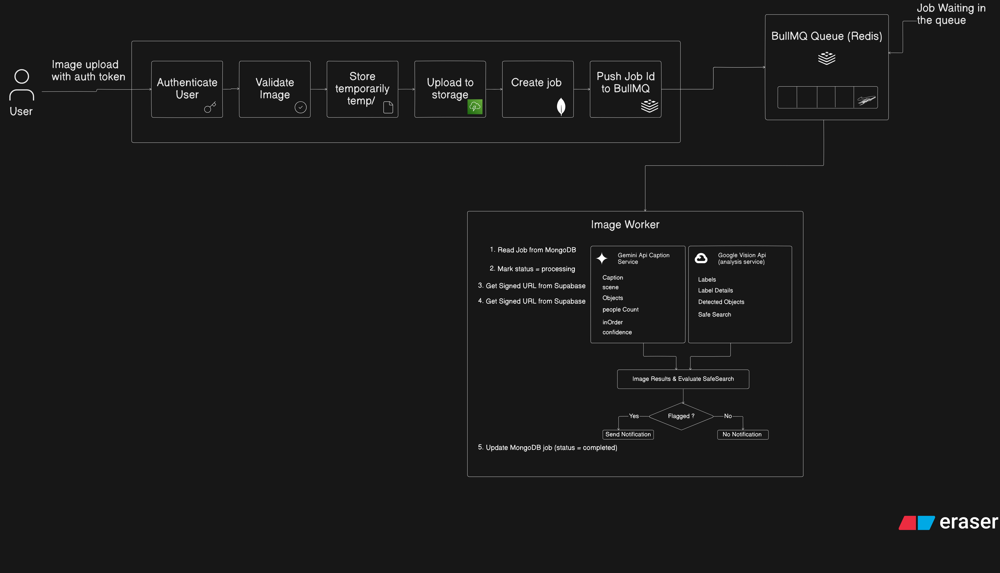
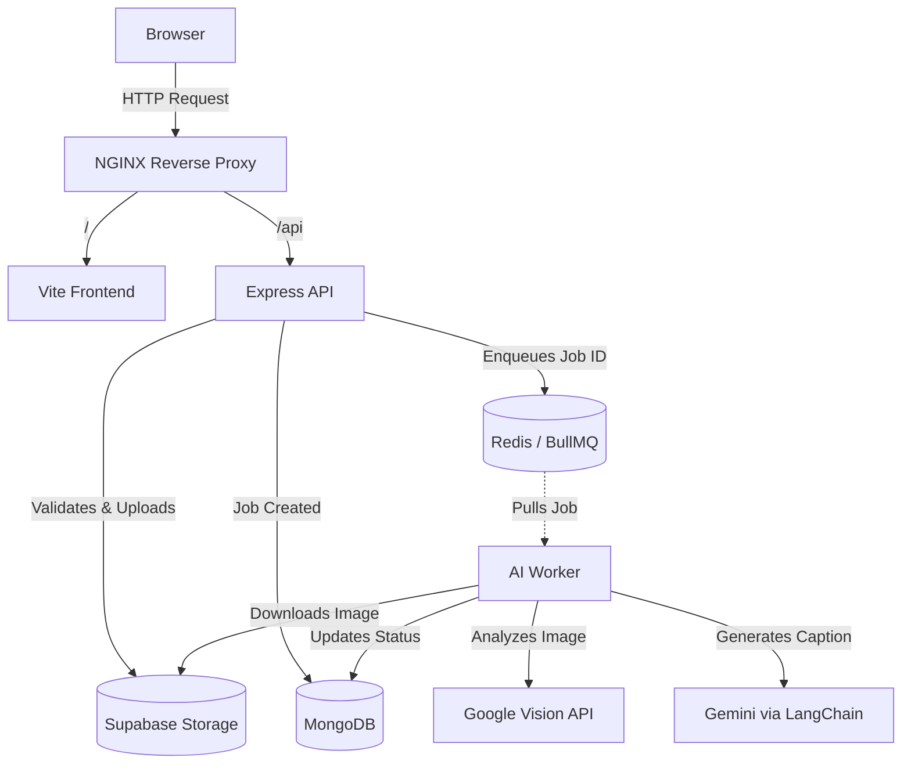

# Camarin AI - ImageInsight

ImageInsight is a robust, asynchronous image processing platform. It provides users with a clean, brutalist-inspired dashboard to upload images, which are then queued and processed in the background by AI workers. The system extracts captions, detects objects, and identifies scene details using a combination of LangChain (Gemini) and Google Cloud Vision.

## 📁 Project Structure

The repository is organized into distinct microservices to ensure scalability and separation of concerns:

```text
camarin-ai/
├── frontend/          # React + Vite SPA (Dashboard, Auth, Image View, Framer Motion animations)
│   └── nginx/         # NGINX reverse proxy configuration for seamless frontend/API routing
├── backend/           # Express.js REST API (User Auth, Rate Limiting, File Uploads)
├── worker/            # Node.js Background Worker (BullMQ, LangChain, Google Vision API)
├── postman/           # Postman Collection for API testing
├── docker-compose.yml # Full stack container orchestration
└── README.md          # You are here
```

## 🏗️ Architecture & Workflow



The platform uses an asynchronous event-driven architecture to prevent compute-heavy AI tasks from blocking user interactions.



1. **Upload Phase**: The user authenticates and uploads an image. The `backend` intercepts the multipart request, validates the magic bytes (to prevent malicious uploads), and securely stores the raw image in Supabase Storage.
2. **Queueing Phase**: A job document is created in MongoDB with a `pending` status. The job ID is pushed to a Redis-backed BullMQ queue. The backend immediately responds to the user (202 Accepted).
3. **Processing Phase**: The `worker` continuously polls the Redis queue. When a job is picked up, it downloads the image from Supabase and runs it through Google Vision and LangChain/Gemini for analysis in parallel.
4. **Completion**: The worker updates the job in MongoDB with the extracted metadata (captions, object labels, safe search flags). The frontend polls for status changes and dynamically updates the UI when processing finishes.

## ⚙️ Environment Variables

The project uses separate `.env` files for each microservice. You must create these files in their respective directories before starting the application.

### 1. Backend (`backend/.env`)

Create this file to configure the Express API:

```env
PORT=8000
NODE_ENV=development

# Database & Cache
MONGODB_URL=mongodb://mongodb:27017
DB_NAME=camarin-ai
REDIS_HOST=redis
REDIS_PORT=6379

# Authentication (Generate your own random strings)
ACCESS_TOKEN_SECRET=your_super_secret_access_token_key_here
REFRESH_TOKEN_SECRET=your_super_secret_refresh_token_key_here
ACCESS_TOKEN_TTL=15m
REFRESH_TOKEN_TTL=7d

# Supabase Storage
SUPABASE_URL=your_supabase_project_url
SUPABASE_KEY=your_supabase_anon_or_service_key
SUPABASE_BUCKET=your_storage_bucket_name

# Frontend Origin for CORS
FRONTEND_URL=http://localhost
```

### 2. Worker (`worker/.env`)

Create this file to configure the AI processing worker:

```env
PORT=8001
NODE_ENV=development

# Database & Cache
MONGODB_URL=mongodb://mongodb:27017
DB_NAME=camarin-ai
REDIS_HOST=redis
REDIS_PORT=6379

# Supabase Storage (Must match backend)
SUPABASE_URL=your_supabase_project_url
SUPABASE_KEY=your_supabase_anon_or_service_key
SUPABASE_BUCKET=your_storage_bucket_name

# AI Services
GEMINI_API_KEY=your_gemini_api_key_here
CAPTION_MODEL=gemini-2.5-flash
# Docker maps the gcp-key.json to this exact path automatically
GOOGLE_APPLICATION_CREDENTIALS=/app/gcp-key.json
```

*Note: You must also place your actual Google Vision JSON key file at `worker/gcp-key.json` so Docker can mount it securely into the worker container.*

### Obtaining API Keys
- **Gemini API Key:** Go to [Google AI Studio](https://aistudio.google.com/), sign in, and create an API key.
- **Google Vision JSON:** Go to the [Google Cloud Console](https://console.cloud.google.com/), enable the Cloud Vision API, create a Service Account, generate a JSON key, and save it as `gcp-key.json` inside the `worker/` directory.
- **Supabase:** Create a project at [Supabase](https://supabase.com). Go to Project Settings > API to get your `SUPABASE_URL` and `SUPABASE_KEY`. Create a public storage bucket named `image-insight` (or whatever you set `SUPABASE_BUCKET` to).
- **MongoDB:** Use [MongoDB Atlas](https://www.mongodb.com/atlas) to spin up a free cluster and get your connection string.

## 🚀 Running with Docker Compose

The entire stack can be launched via Docker Compose. It automatically wires up the Frontend, Backend, Worker, Redis, and NGINX Proxy.

1. Ensure Docker and Docker Compose are installed.
2. Ensure your `.env` files are populated in `backend/` and `worker/`.
3. Ensure your Google Vision JSON key is located at `worker/gcp-key.json`.
4. Build and start the services:

```bash
docker compose up --build
```

The application will be available at:
- **Frontend / Dashboard**: `http://localhost`
- **Backend API**: `http://localhost/api/v1`

## 📮 API Testing (Postman)

A Postman collection is included to help you easily test the backend endpoints directly. 

1. Open Postman and click **Import**.
2. Select the `postman/camarin-ai.postman_collection.json` file.
3. Use the imported requests to test Authentication (Register/Login) and Jobs (Upload/Retry/Status).

## 🧠 Assumptions & Design Decisions

Where the spec was open-ended, the following decisions were made:

- **Notification Strategy (Flagged Content)**: The spec required notifying someone when NSFW content is detected. Rather than introducing an external dependency like SendGrid (email) or Slack Webhooks, the system relies on a **structured log-and-persist strategy**. It logs a `[WARN] FLAGGED_CONTENT_ALERT` and updates a `flaggedNotifiedAt` timestamp in MongoDB. In a real environment, log aggregators (Datadog/CloudWatch) would trigger alerts based on this log.
- **Asynchronous Processing**: Decoupled the API and Worker using Redis and BullMQ. This ensures that the web server remains highly responsive and can accept uploads at a massive scale without being bogged down by slow AI inference times.
- **Stateless/Stateful Auth Hybrid**: Access tokens are stateless JWTs for fast, database-free verification. Refresh tokens are stateful (hashed and stored in MongoDB), allowing administrators to revoke compromised sessions remotely.
- **Proxy Routing**: By using NGINX to route both `/` and `/api` through a single domain (`localhost`), we eliminate complex CORS preflight issues and guarantee that `HttpOnly` `sameSite="lax"` auth cookies flow securely between the browser and backend.

## ⚠️ Known Limitations

- **Signed URL Bottleneck**: Currently, the backend generates signed URLs for *every* image when the user requests their job list. This is an $O(N)$ operation per request and relies heavily on the Supabase SDK, which may become a bottleneck for users with hundreds of images.
- **Single Point of Failure**: MongoDB and Redis are currently configured as single instances without clustering.

## 📈 10x Scalability Plan

If traffic were to increase by 10x, the following architectural upgrades would be required:

1. **Compute Scaling**: Since the Worker is completely stateless and BullMQ handles atomic locking, we can horizontally scale the `worker` service to 50+ instances across Kubernetes pods. They will all safely pull from the same Redis queue without duplicating work.
2. **Database Read-Replicas**: Introduce MongoDB read-replicas for the dashboard job-list queries. The primary node would only handle writes (new jobs, status updates from workers).
3. **CDN Integration**: Shift away from generating dynamic signed URLs on the fly. Instead, implement an enterprise CDN (AWS CloudFront or Cloudflare) with a signed-cookie policy to cache and serve images at the edge, drastically reducing backend CPU load and egress costs.
4. **API Response Caching**: Introduce a Redis caching layer in the Express API to cache user profiles (`/api/v1/users/me`) and paginated job lists for up to 60 seconds, reducing load on MongoDB.
